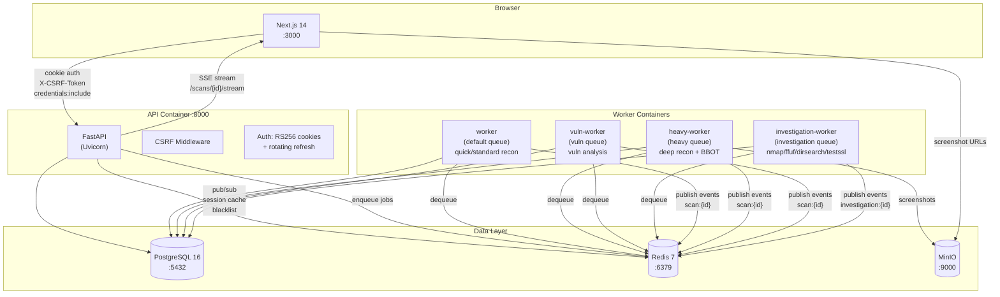
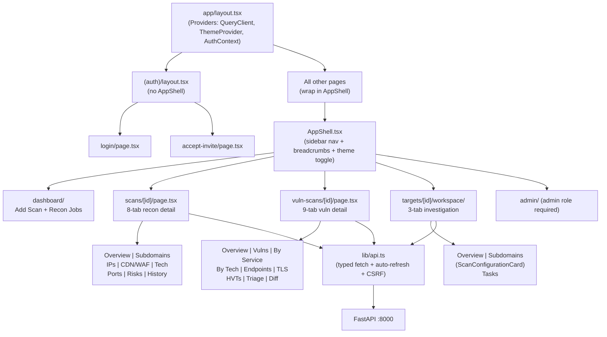
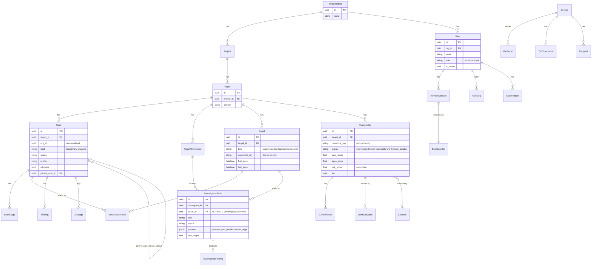
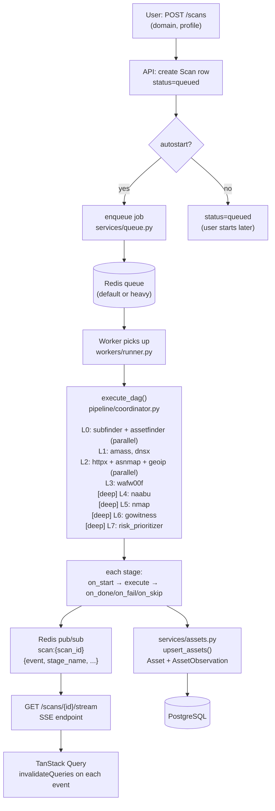
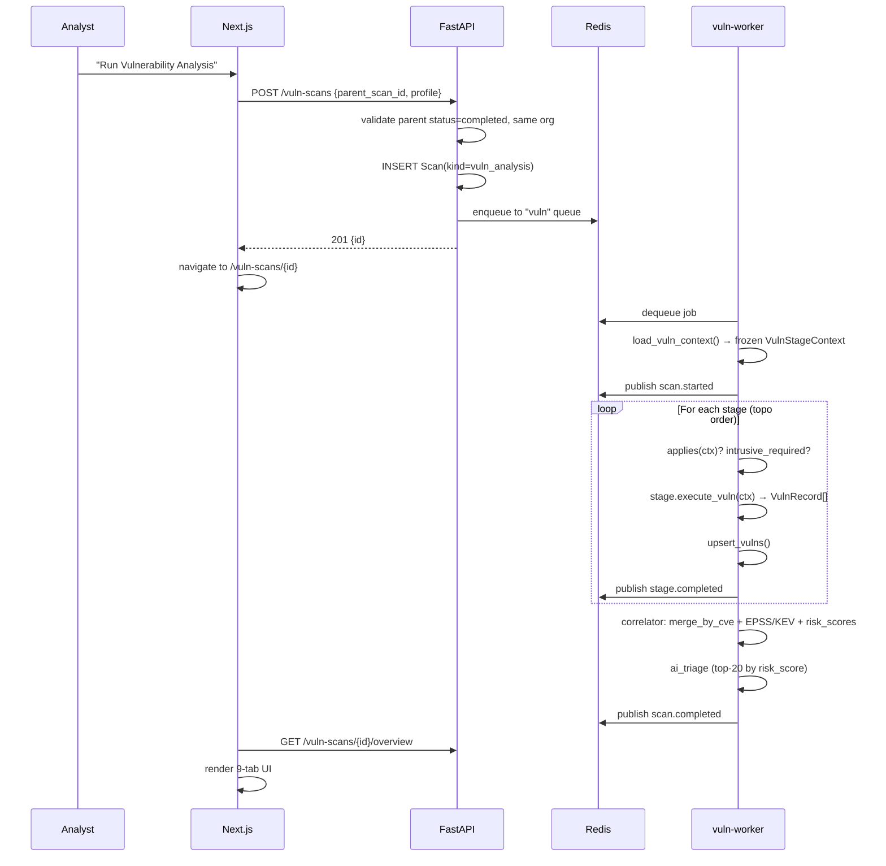
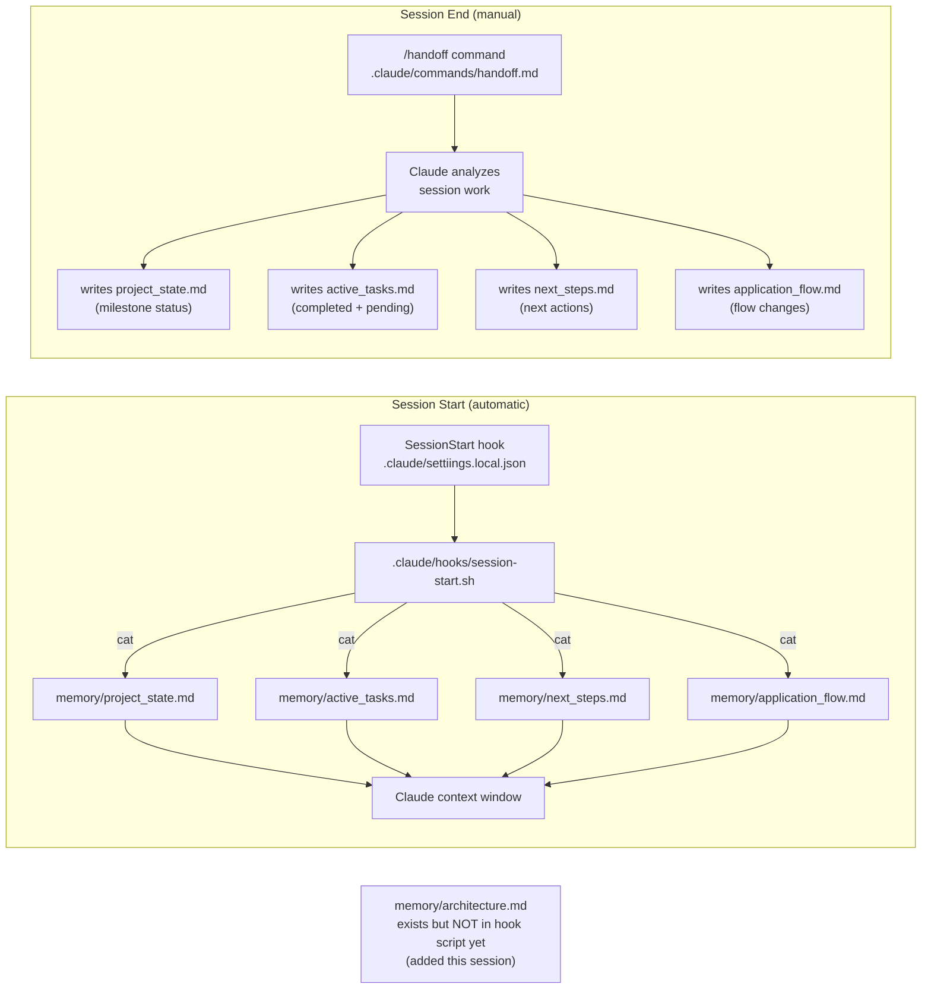
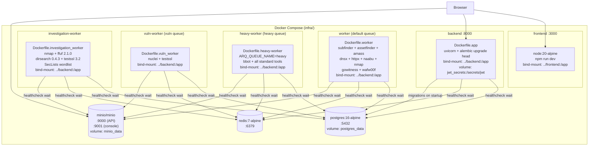

# Architecture

> All 8 diagrams also collected in [`docs/diagrams.md`](diagrams.md) as a quick-reference index.

---

## 1. High-Level System Architecture

The platform is a **five-plane layered monolith** — all code lives in one repo with enforced module boundaries. No microservices split (explicitly deferred).



---

## 2. Five-Plane Layered Monolith

| Plane | Responsibility | Key Paths |
|---|---|---|
| **Presentation** | Next.js App Router, TanStack Query, Radix UI, Tailwind | `frontend/app/`, `frontend/components/`, `frontend/lib/api.ts` |
| **API** | FastAPI routers, Pydantic schemas, RBAC deps, CSRF | `backend/app/api/`, `backend/app/schemas/` |
| **Orchestration** | DAG executors (recon + vuln), investigation runner, scan profiles | `backend/app/pipeline/coordinator.py`, `pipeline/vuln/coordinator.py`, `workers/investigation_runner.py` |
| **Execution** | Arq workers per queue, subprocess sandboxing, pub/sub | `backend/app/workers/` |
| **Data** | PostgreSQL (ORM + migrations), Redis (queue + pub/sub + session), MinIO | `backend/app/models/`, `backend/migrations/`, `backend/app/core/` |

### Module boundary rules

| Module | MUST | MUST NOT |
|---|---|---|
| `pipeline/adapters/*` | invoke CLI tool, parse output, return `AssetRecord[]` | touch DB |
| `pipeline/vuln/adapters/*` | consume frozen `VulnStageContext`, return `VulnRecord[]` | touch assets/services/technologies; re-run recon tools |
| `pipeline/investigation/adapters/*` | return `FindingRecord[]`, `ServiceUpdateRecord[]`, `EndpointRecord[]` | write to DB directly |
| `services/assets.py` | upsert Asset + AssetObservation (flush only) | run subprocesses |
| `services/vulns.py` | upsert Vulnerability + VulnEvidence + VulnRunMatch (flush only) | touch assets/services/technologies |
| `workers/runner.py` | recon scan lifecycle, pub/sub, progress tracking | contain business logic |
| `agents/risk_prioritizer.py` | read asset graph, call LLM, write findings | return `AssetRecord[]` |

---

## 3. Frontend Component Architecture



---

## 4. Database Entity Relationships



---

## 5. Authentication Flow

```mermaid
sequenceDiagram
    participant B as Browser
    participant API as FastAPI
    participant DB as PostgreSQL
    participant RD as Redis

    Note over B,API: Login
    B->>API: POST /auth/login {email, password}
    API->>DB: lookup User, verify bcrypt hash
    API->>DB: INSERT RefreshSession (opaque token hash)
    API->>RD: HSET session:{id} + SADD session:user:{uid}
    API-->>B: Set-Cookie: rt_access (HttpOnly, 10min)<br/>rt_refresh (HttpOnly, path=/auth, 14d)<br/>rt_csrf (JS-readable)
    API-->>B: 200 {csrf_token, user}

    Note over B,API: Authenticated Request
    B->>API: GET /scans (Cookie: rt_access; X-CSRF-Token: ...)
    API->>RD: EXISTS blacklist:jti:{jti}?
    API->>DB: get User by id
    API-->>B: 200 [scans]

    Note over B,API: Token Refresh (transparent)
    B->>API: GET /scans → 401
    B->>API: POST /auth/refresh (Cookie: rt_refresh)
    API->>DB: find RefreshSession by token hash
    API->>DB: mark old session revoked (rotation)
    API->>DB: INSERT new RefreshSession
    API-->>B: Set-Cookie: new rt_access, rt_refresh, rt_csrf
    B->>API: GET /scans (retry with new rt_access)
    API-->>B: 200 [scans]

    Note over B,API: Logout
    B->>API: POST /auth/logout
    API->>DB: revoke RefreshSession
    API->>RD: DEL session:{id}
    API-->>B: Clear all 3 cookies
```

---

## 6. Recon Pipeline Flow



---

## 7. Vulnerability Scan Flow



---

## 8. Memory and Hooks Flow



---

## 9. Deployment Architecture



---

## Tenant Isolation Architecture

Every scan-related query filters by `Scan.org_id`. This field is denormalized from the `Target → Project → Organization` chain so list and detail queries scope in a single WHERE clause without a 3-table join.

`CurrentUser.scan_filter()` (in `backend/app/api/deps.py`) extends isolation with RBAC:
- **admin**: sees all scans in the organization
- **analyst**: sees only scans where `Scan.created_by == user.id`

New tables that hold tenant data must follow the same denormalization pattern or join through `Project`.

---

## Queue Routing

| Queue name | Worker container | Dockerfile | Tools installed | What runs there |
|---|---|---|---|---|
| `default` | `worker` | `Dockerfile.worker` | subfinder, assetfinder, amass, dnsx, httpx, naabu, nmap, gowitness, wafw00f | quick + standard recon scans |
| `heavy` | `heavy-worker` | `Dockerfile.heavy-worker` | all above + bbot | deep recon profile (bbot runs concurrently with passive stages) |
| `vuln` | `vuln-worker` | `Dockerfile.vuln_worker` | nuclei, testssl | vulnerability analysis scans |
| `investigation` | `investigation-worker` | `Dockerfile.investigation_worker` | nmap, ffuf, dirsearch, testssl, SecLists | per-asset investigation tasks from Target Workspace |
