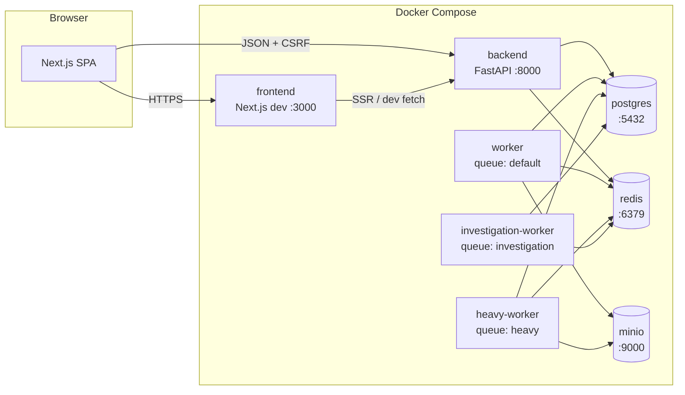
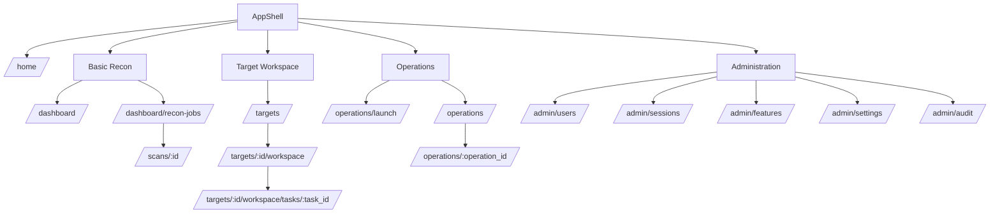
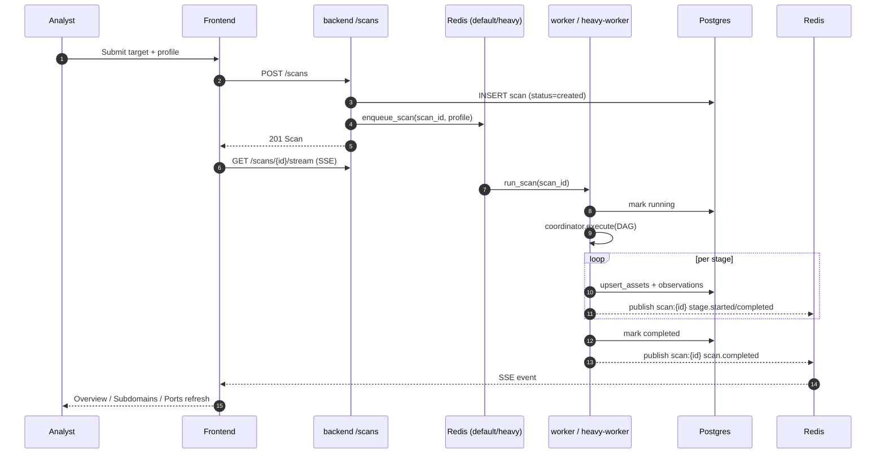
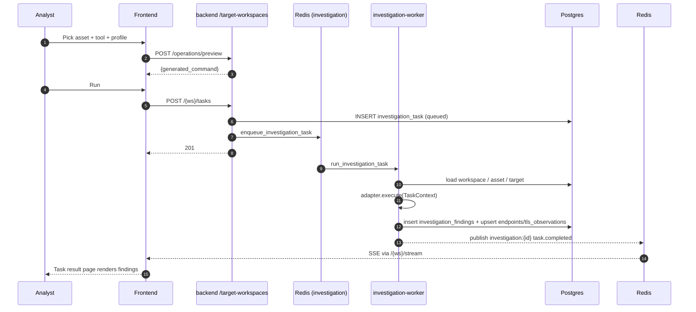
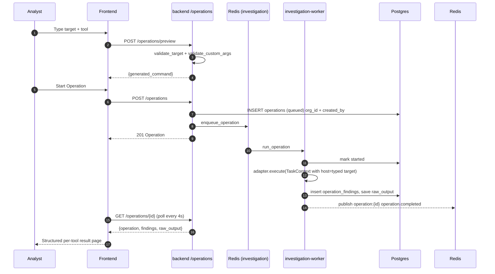
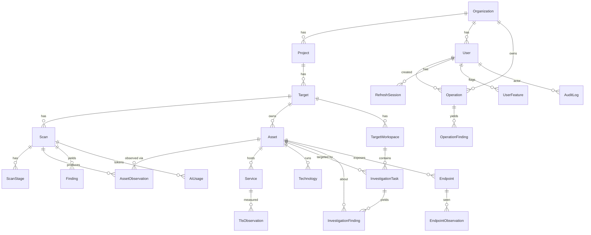
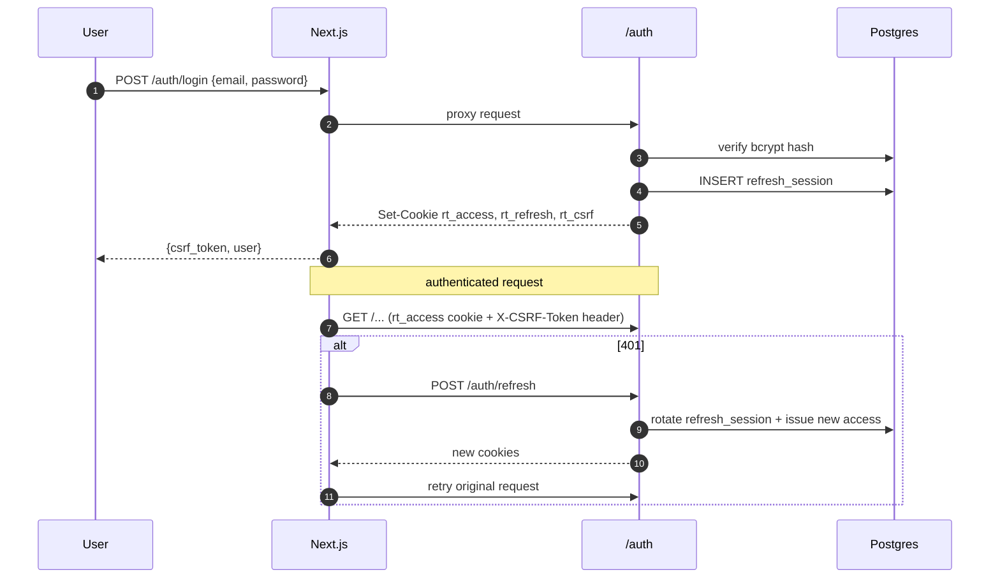

# Diagrams

Mermaid diagrams of the current runtime. Renders on GitHub. For prose, see
[`architecture.md`](architecture.md).

---

## 1. Container layout



---

## 2. Feature nav (App Router)



---

## 3. Recon scan lifecycle



---

## 4. Investigation task lifecycle



---

## 5. Operation lifecycle (standalone)



---

## 6. Data model (ER, current)



Notes:
- `Vulnerability` / `VulnEvidence` / `VulnRunMatch` / `CveIntel` /
  `HvtSignal` all removed by migration `0020`.
- `Operation` is **not** linked to `Target` / `Asset` — that isolation is the
  whole point of the Operations Console.

---

## 7. Auth flow



---

## 8. OpenRouter config resolution

```mermaid
flowchart LR
    APP[Any AI caller<br/>e.g. risk_prioritizer]
    APP -->|get_openrouter_config(db)| SVC[services/system_settings.py]
    SVC -->|SELECT| DB[(system_settings)]
    DB -.->|miss| ENV[Env OPENROUTER_API_KEY]
    SVC --> APP
    APP -->|bounded_completion(model, api_key)| OR[OpenRouter HTTPS]
```

- DB miss falls back to env.
- Model miss falls back to `openai/gpt-oss-20b:free`.
- Raw key never returned by any API; the admin card exposes only
  `api_key_set` + last-4 hint.
